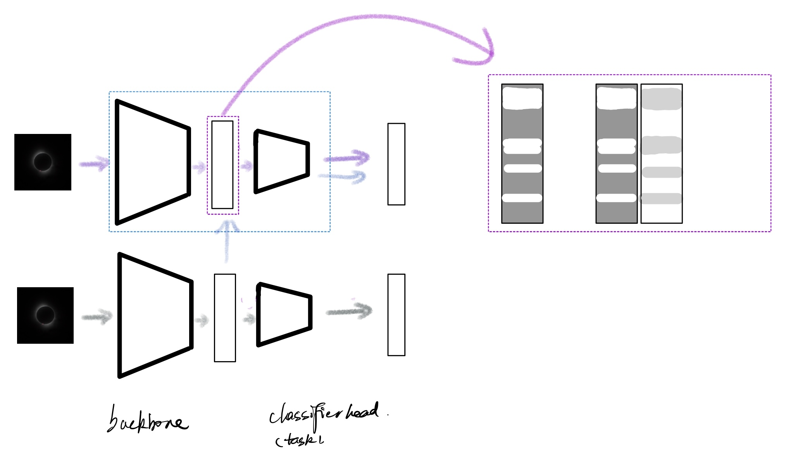
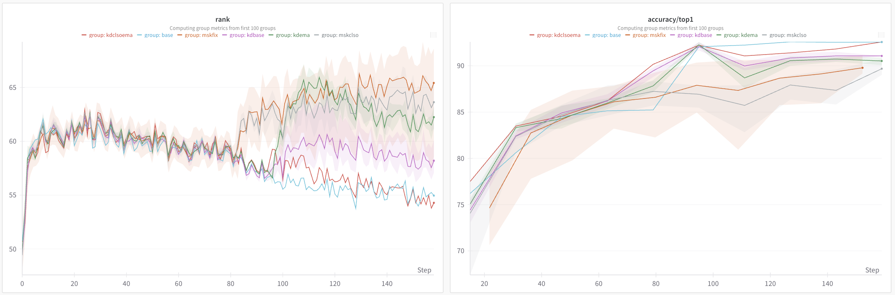

## Introduction
in this repo, we provide code for project " Investigating masked model in representation learning and anti-forgetting". Here we will provide guidance for installation, peforming experiments and some results.

## Install 

Please refer to MMpretrain for more details, below are the copy of theirs:

Below are quick steps for installation:

```shell
conda create -n open-mmlab python=3.8 pytorch==1.10.1 torchvision==0.11.2 cudatoolkit=11.3 -c pytorch -y
conda activate open-mmlab
pip install openmim
git clone https://github.com/open-mmlab/mmpretrain.git
cd mmpretrain
mim install -e .
```

Please refer to [installation documentation](https://mmpretrain.readthedocs.io/en/latest/get_started.html) for more detailed installation and dataset preparation.

For multi-modality models support, please install the extra dependencies by:

```shell
mim install -e ".[multimodal]"
```
For wandb log, please install wandb using the following
```shell
pip install wandb
wandb login
```
and uncomment the following line from the corresponding config file in **cifar-img/dl_res18_exp**
```shell
# vis_backends = dict(type='WandbVisBackend', xxxxxxxxx
```


---

## Experiments
All experiments can be seen in **tools/res_trails directory** \
All related configurations can be seen in **cifar-img/dl_res18_exp**

### Baseline - naive training /KD training
The experiments of naive CE training can be found in **/tools/cl_trails/baseline_CE** \
Corresponding configs are in **cifar-img/dl_res18_exp/baseline**
```shell
bash  /---your---own---working--dir--/tools/cl_trails/baseline_CE/run_baselinece.sh
```
The experiments of KD training can be found in **tools/cl_trails/baseline_KD** \
Corresponding configs are in **cifar-img/dl_res18_exp/baseline**
```shell
#reference model basic swap and freeze
bash  /---your---own---working--dir--/tools/cl_trails/baseline_KD/run_kdbaseline.sh

#change the reference model using EMA
bash /---your---own---working--dir--/tools/cl_trails/baseline_KD/run_kdema_var.sh 0.1 #emaratio
#${ema_ratios[$SLURM_ARRAY_TASK_ID]} #for slurm array job

#for further classifier only(clso: we only use the classifer head as reference model) experiments, just change the config: model.train_cfg.cls_only=True
```
### Masked - Loss_msk type, Mode, Ratio
The masked model in this work can be illustrated in the following figure: 
<!--  -->
\
<!-- where the **backbone** and **classifier (task) head** are denoted by **black trapezoids**, and a **black rectangle** represents the hidden/output feature. Here, the **gray arrow** denotes the baseline CE pipeline, and the **purple arrow** shows the KD/Masked reference pipeline.

The **purple rectangle** denotes the Masked Model method, where we apply a mask in the hidden feature. While the classifier head requires the input channel unchanged, we apply mask tokens to append the masked part, as shown in the **purple dashed rectangle** on the left.

Inside this rectangle, the **gray part** represents the masked appended token, and the **white part** is the unmasked part. On the right part, we have two inverse masked representations. Getting inspired by the diffusion model where the model predicts the noise, we provide the inverse masked feature to the model, hoping the model recovers better from the masked representation (the inverse forward has detached gradient).

- **Black trapezoid**: Backbone and classifier (task) head
- **Black rectangle**: Hidden/output feature
- **Gray arrow**: Baseline CE pipeline
- **Purple arrow**: KD/Masked reference pipeline
- **Purple rectangle**: Masked Model method
- **Gray part inside the purple rectangle**: Masked appended token
- **White part inside the purple rectangle**: Unmasked part -->


where the **backbone** and **classifier (task) head** are denoted by  `black trapezoids`, and a  `black rectangle` represents the hidden/output feature. Here, the  `gray arrow` denotes the baseline CE pipeline, and the  `light purple arrow` shows the KD/Masked reference pipeline.

The  `light purple rectangle` denotes the Masked Model method, where we apply a mask in the hidden feature. While the classifier head requires the input channel unchanged, we apply mask tokens to append the masked part, as shown in the  `light purple dashed rectangle` on the left.

Inside this rectangle, the  `gray part` represents the masked appended token, and the  `white part` is the unmasked part. On the right part, we have two inverse masked representations. Getting inspired by the diffusion model where the model predicts the noise, we provide the inverse masked feature to the model, hoping the model recovers better from the masked representation (the inverse forward has detached gradient).

In addition to the base-KD/Mask model, we further introduce the `cls_only` line of KD/Mask model, which is illustrated with the same masked strategy and a  `light blue arrow`.

-  `Black trapezoid`: Backbone and classifier (task) head
-  `Black rectangle`: Hidden/output feature
-  `Gray arrow`: Baseline CE pipeline
-  `Light purple arrow`: KD/Masked reference pipeline
-  `Light purple rectangle`: Masked Model method
-  `Gray part inside the light purple rectangle`: Masked appended token
-  `White part inside the light purple rectangle`: Unmasked part
-  `Light blue arrow`: cls_only line of KD/Mask model


### Masked_classifier_only - Loss_msk type, Mode, Ratio
The experiments of Masked model training can be found in **tools/cl_trails/mask** \
Corresponding configs are in **cifar-img/dl_res18_exp/mask**
```shell
bash  /---your---own---working--dir--/tools/cl_trails/mask/run_mskall_var.sh 0.9 'v1' 'sgf' #mask_ratio #inv_mode #mask_mode
# for inv_mode
    # this is just a selection between whether 
     ## v1: we add the inv_mask output logits on masked output
     ## v2: we substract the inv_mask output logits from the target outputs
     ###  p.s. target outputs[the under rectangle logits in the figure]
            #  masked output[the upper rectangle logits]
# for mask_mode
    # this is just difference of different selection of masked tokens to append the in_channel 
     ## s: we use single 1*1 torch tensor 
     ## a: we use all 1*(channels- channels*mask_ratio) torch tensor
     ## sgd: single tensor with gradient=false
     ## agd: all tensor with gradient=false
     ###  p.s.: [all will be expanded as same batch-size of hidden feature.]

bash  /---your---own---working--dir--/tools/cl_trails/mask/run_mskclso_var.sh 0.9 'v1' 'sgf' #mask_ratio #inv_mode #mask_mode


bash  /---your---own---working--dir--/tools/cl_trails/mask/run_mskclso_var.sh 0.9 'v1' 'sgf' 0.1 'ema' #mask_ratio #inv_mode #mask_mode #ema_ratio #ema_mode
# for ema_mode
    # this is just a seletion of different ema_mode
     ## 'ema' ExponentialMovingAverage
     ## 'anne' MomentumAnnealingEMA
     ## 'sto' StochasticWeightAverage

```


## Results
### KD, Mask
All baseline and Self-KD hyperparameter results table can be found in ***tools/cl_trails/test_cl.sh***, ***tools/cl_trails/baseline_KD/run_SD.md***

### All method comparision using wandb
 Rank(me) details see: https://arxiv.org/abs/2210.02885, can be explained as a kind of feature learning quality metric, similar to the rank of representation.

Here we can clearly see in the plot
 - So far the KD ema results have slightly better accuracy/top1 results and larger rankme value (not fully shown explained in note) [purple VS blue]
 - The naive training [blue] have the tendency of constant droping Rank, which may due to the influence of classifer head(which has a large-to-small compression, but do not show on SSL method, which have a small-to-large[or kind of equivilant] reconstruction head)
 - KD/Mask have the power of considerably increase the rank of our feature learning process, but for mask, the accuracy part do not surpass the baseline.(maybe can try a linear probing accuracy?)
 - 


***Note: Since HPC require storage limitations, so I'm annoyed by wandb's artifacts, I accidentally rm -rf * of some of the logs of wandb results while deleting the wandb cache.***

### TODO
- Test masked results performance on CIFAR-10.1 dataset.
- Test longer epochs of key hyperparameter selections.
- Finish EMA masked model results.
- Finish masked experiments on continual learning setting.
<!-- ### Baseline- architecture modification
Follow the scripts in run_baseline.sh

```shell
 sh tools/res_trails/run_baseline.sh
```
### Ensemble, etc.
Follow the scripts in run_ensemble.sh

```shell
 sh tools/res_trails/run_ensemble.sh
```
### Normalization, Activation, Dropout, Masking
Follow the scripts in run_cfgs.sh

```shell
 sh tools/res_trails/run_cfgs.sh
```

#### Results, and evaluation.

```shell
 sh tools/res_trails/run_evaluation.sh
``` -->